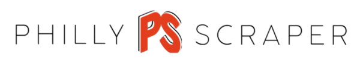

 

This project was the homework for week 18 of the Penn Coding Boot Camp.

## Goal
To create a full-stack NodeJS application that would use web scraping to obtain data and persist it using MongoDB.

## Installation and Set-up
Please run *npm install* at the root directory after cloning the project.

Then in the command line, run either `node server.js` or `npm start`, and direct your browser to `localhost:3000`.
You can also use the deployed version of this app at: https://phillyscraper.herokuapp.com/

## Functionality
This is a single page application that lists events going on around the Philadelphia area. Articles about these events are scraped from the *uwishunu* website (https://www.uwishunu.com/).

## Objective
* To create a server using ExpressJS that will route html traffic by processing GET requests, and store and process data with POST requests.
* To create a full-stack application using Handlebars, CSS, Bootstrap, JavaScript/jQuery, MongoDB and NodeJS.

## Built using:
* Handlebars
* CSS
* Bootstrap
* git
* GitHub
* Heroku
* JavaScript
* jQuery
* NodeJS
* ExpressJS
* MongoDB

## Authors
**Guillermo Barila** - *Author*